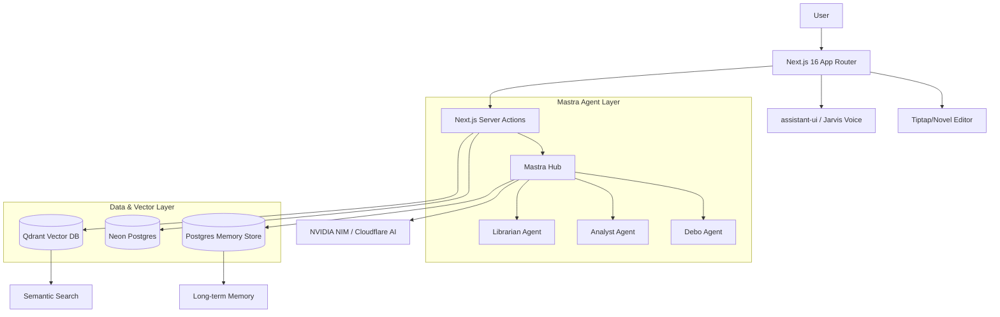

# Debo — Your Life intelligence System

> [!IMPORTANT]
> **Project Jarvis is live!** We've launched a real-time, ambient voice intelligence layer that allows you to talk to your life context naturally. [Learn more about the vision.](https://github.com/SH20RAJ/debo/issues/36)

Debo is not a journal with a chat box. It is a **Life Intelligence System**: a private layer that learns from your writing, retrieves your history with citations, detects patterns across time, and turns memory into useful guidance.

Live at: [debo.life](https://debo.life)

## 🕯️ Vision: Editorial Calm

Most journaling apps store text. Debo stores meaning.

It is designed to learn the structure of your life over time: what matters to you, who shows up often, which emotions repeat, and which habits lead to momentum. The result is an assistant that can answer questions about your past, surface relevant memories, and proactively point out patterns before they become obvious.

Debo follows a philosophy of **Editorial Calm**:
- **Warm Cream Canvas**: A distraction-free, magazine-like aesthetic (\`#f7f7f4\`).
- **Typography-First**: Using premium sans-serifs and monospaced code for clarity.
- **Quiet Confidence**: Minimal hairlines, no drop shadows, and generous breathing room.

## 🚀 Core Features

### AI Memory Engine
Powered by **Mastra**, Debo extracts facts, preferences, people, and goals from your entries to build a durable, long-term memory that survives beyond a single session.

### Ask Your Life
Ask "When was I happiest this year?" or "What helped me focus last month?" Debo retrieves journal evidence and memory context, answering with **clickable citations** grounded in your own data.

### Project Jarvis (Voice)
A real-time, low-latency ambient voice interface powered by **LiveKit**. Talk to your journal naturally—ask about your day or reflect on memories while on the move with sub-second response times.

### Pattern Detection Engine
Debo looks for behavioral loops, recurring stressors, and emotional trends across weeks and months, highlighting them before they become obvious.

### Memory Graph
See how people, topics, and emotions connect in your life. Understand who shows up in your progress stories and what topics are tied to high-stress periods.

## 🏗️ Technical Architecture

## 🛠️ Tech Stack

- **Framework**: Next.js 16 (App Router), React 19
- **Orchestration**: [Mastra](https://mastra.ai) (Multi-agent orchestration)
- **AI Inference**: [NVIDIA NIM](https://build.nvidia.com/) (Meta Llama 3.3 70B)
- **Vector Database**: [Qdrant](https://qdrant.tech/)
- **Database**: [Neon](https://neon.tech/) (Serverless Postgres)
- **Auth**: [Stack Auth](https://stack-auth.com/) (Open Source alternative to Clerk)
- **Styling**: Tailwind CSS v4, shadcn/ui
- **Voice**: [LiveKit](https://livekit.io/)
- **Deployment**: [Cloudflare Workers](https://workers.cloudflare.com/) via OpenNext

## 🏁 Getting Started

### 1. Prerequisites
- [Bun](https://bun.sh/)
- A [Neon](https://neon.tech/) database
- [Stack Auth](https://stack-auth.com/) project
- [NVIDIA NIM](https://build.nvidia.com/) API Key (or OpenAI key)
- [Qdrant](https://qdrant.tech/) Cluster

### 2. Installation
\`\`\`bash
bun install
\`\`\`

### 3. Environment Setup
Copy \`.env.example\` to \`.env.local\` and fill in the required keys.

### 4. Database Setup
\`\`\`bash
bun run db:push
\`\`\`

### 5. Run Locally
\`\`\`bash
bun run dev
\`\`\`

## 🤝 Contributing

We welcome contributions! Whether you're fixing a bug, adding an agent tool, or improving documentation:

1. **Fork the repo** and create your branch from \`main\`.
2. Ensure your code follows the **Editorial Calm** design guidelines.
3. Open a PR with a clear description of your changes.

See our [Contributing Guide](./CONTRIBUTING.md) for full details.

## 📄 License

MIT © [SH20RAJ](https://github.com/SH20RAJ)
