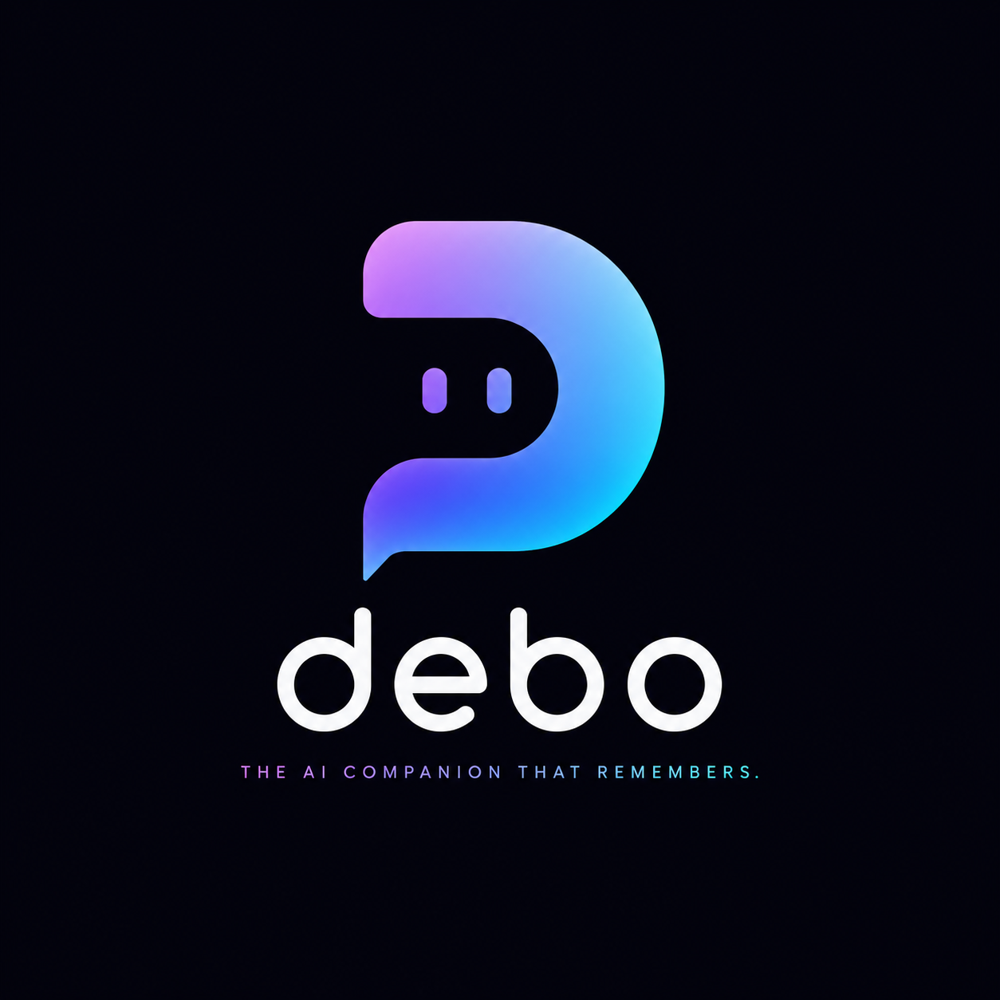

# Debo — Your Life Intelligence System

<p align="center">
  
</p>

> Debo is not a journal with a chat box. It stores meaning, not just text — turning your life data into genuine self-knowledge.

[](https://nextjs.org/)
[](https://mastra.ai/)
[](./LICENSE)

## What is Debo?

Debo is a **Life Intelligence System** that learns from your writing, retrieves your history with citations, detects patterns across time, and turns memory into useful guidance.

### Core Features

- **AI Memory Engine** — Extracts facts, preferences, people, and goals from your entries into durable, long-term memory
- **Ask Your Life** — Ask natural questions like "When was I happiest this year?" with clickable citations
- **Pattern Detection** — Surface behavioral loops, recurring stressors, and emotional trends
- **Memory Graph** — Visualize connections between people, topics, and emotions
- **Voice Capture (Jarvis)** — Real-time ambient voice interface with sub-second response

## Tech Stack

- **Framework**: Next.js 16 (App Router), React 19
- **Orchestration**: Mastra (multi-agent system)
- **AI**: NVIDIA NIM / OpenAI / Anthropic
- **Database**: Neon (PostgreSQL), Qdrant (Vector DB)
- **Auth**: Stack Auth
- **Voice**: LiveKit
- **Deployment**: Cloudflare Workers

## Getting Started

```bash
# Install dependencies
bun install

# Copy environment variables
cp .env.example .env.local

# Set up database
bun run db:push

# Run development server
bun run dev
```

Then open [http://localhost:3000](http://localhost:3000)

## Project Structure

```
src/
├── app/           # Next.js App Router pages
├── actions/       # Server Actions (auth, chat, journals, memories)
├── components/    # UI components (dashboard, landing, chat)
├── db/            # Drizzle ORM schemas
├── lib/           # Core logic (AI, vector search, memory)
└── mastra/        # Mastra AI agents
```

## Philosophy

Debo follows **Editorial Calm** — a design philosophy focused on:
- Distraction-free, magazine-like aesthetic
- Typography-first approach
- Minimal UI with generous whitespace

## Technical Architecture

```mermaid
graph TD
    User[User] --> Web[Next.js 16 Web UI]
    User --> Voice[LiveKit Jarvis Voice Agent]
    
    subgraph Edge[Cloudflare Edge]
        Web --> Actions[Server Actions]
        Web --> ChatRoute[Chat Runtime]
    end

    subgraph Orchestration[Mastra]
        ChatRoute --> Agents[AI Agents]
        Agents --> Tools[Tools]
    end

    subgraph Storage[Data Layer]
        Tools --> DB[(Neon Postgres)]
        Tools --> Qdrant[(Qdrant Vector)]
    end

    Agents --> LLM[LLM Provider]
    LLM --> Stream[Streaming Response]
    Stream --> User
end
```

### Data Flow

1. **Journal Entry** → Saved to Neon Postgres
2. **Embedding** → Chunked and stored in Qdrant for semantic search
3. **Memory Extraction** → Facts, preferences, people stored in memory table
4. **Query** → Retrieved from both Qdrant (semantic) + Postgres (structured)
5. **Answer** → Grounded response with citations sent back to user

## License

MIT © [SH20RAJ](https://github.com/SH20RAJ)