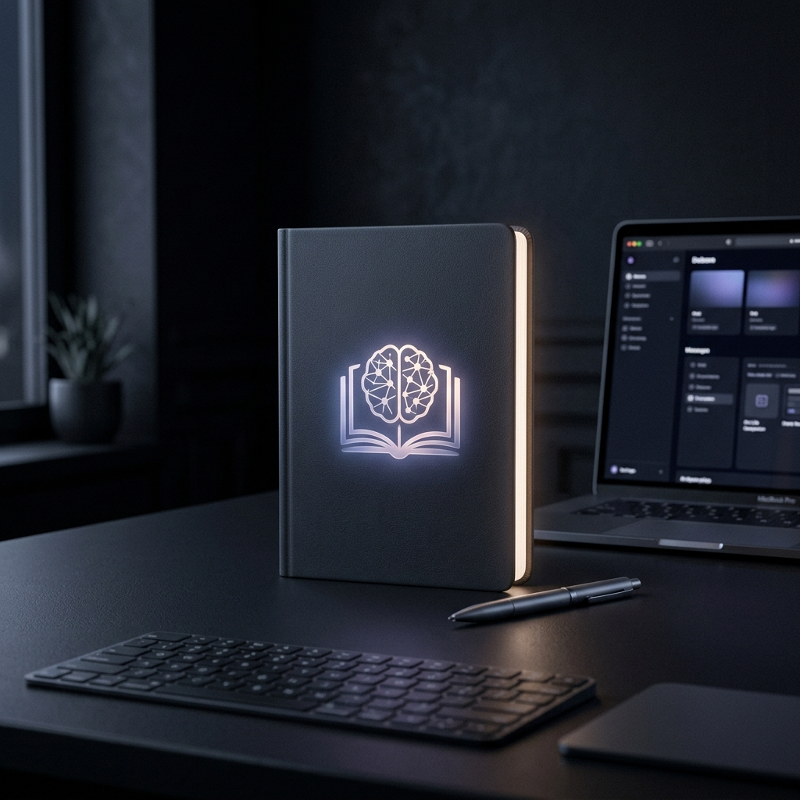
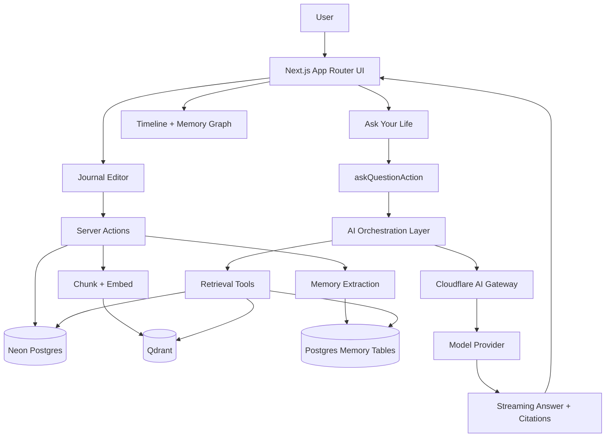

# Debo

[](https://nextjs.org/)
[](https://qdrant.tech/)
[](https://sdk.vercel.ai/)
[](./LICENSE)

Your life, understood by AI.

Debo is not a journal with a chat box. It is a life intelligence system: a private layer that learns from your writing, retrieves your history with citations, detects patterns across time, and turns memory into useful guidance.



## Vision

Most journaling apps store text. Debo stores meaning.

It is designed to learn the structure of your life over time: what matters to you, who shows up often, which emotions repeat, which projects create stress, and which habits lead to momentum. The result is an assistant that can answer questions about your past, surface relevant memories, and proactively point out patterns before they become obvious.

Debo is built for three outcomes:

1. Preserve personal context.
2. Make that context searchable and explainable.
3. Turn memory into better decisions.

## Core Features

### AI Memory Engine

Debo learns from journal entries and stores durable memories through its first-party memory engine. It extracts facts, preferences, people, goals, and recurring details so the system can remember beyond any single conversation.

### Ask Your Life

Ask questions like "When did I last feel burned out?" or "What helped me focus during intense weeks?" Debo retrieves journal evidence and memory context, then answers with citations grounded in your own data.

### Pattern Detection Engine

Debo looks for repetition, not just keywords. It can highlight emotional trends, recurring stressors, common topics, and behavior loops so you can see patterns across weeks and months.

### Life Timeline

Your entries are organized into a structured timeline that makes it easy to review what happened on a day, week, or month. It is designed for reflection, not just storage.

### Memory Graph

Debo connects people, events, emotions, and topics into a personal graph. This makes it easier to answer questions like "Which people are tied to high-stress periods?" or "What topics show up when I am making progress?"

### Proactive AI Insights

Debo does more than react to questions. It can suggest patterns from your history, such as stress before deadlines, deeper focus in the morning, or recurring themes around specific projects.

### Citations

Every answer is grounded in your data. Debo returns citations so you can inspect the journals and memories behind a response instead of trusting a black box.

## UX Philosophy

The interface stays simple on purpose.

Debo uses a minimal, calm surface so the user can focus on writing, asking, and reviewing. The complexity lives underneath in retrieval, memory extraction, ranking, and orchestration. The product should feel light to use even when the system behind it is doing serious work.

## Architecture Overview



## Tech Stack

### Frontend

Next.js 16 App Router, React 19, Tailwind CSS v4, shadcn/ui, and the Vercel AI SDK UI primitives.

### Backend

Next.js Server Actions, route handlers, Better Auth, and Drizzle ORM on top of Neon Postgres.

### AI

Vercel AI SDK, the first-party memory engine, Qdrant, and Cloudflare AI Gateway for provider routing.

### Storage

Neon Postgres for application data, Qdrant for vector search, and structured memory tables for persistent extraction and retrieval.

### Infra

Cloudflare Workers/OpenNext deployment, Wrangler configuration, and edge-friendly AI integration.

## Getting Started

### Install

```bash
bun install
```

### Environment Setup

Copy `.env.example` to `.env` and set the required values for:

- `DATABASE_URL`
- `BETTER_AUTH_SECRET`
- `BETTER_AUTH_URL`
- `QDRANT_URL`
- `QDRANT_API_KEY`
- `OPENAI_BASE_URL`
- `OPENAI_API_KEY`

If you use connectors or MCP tooling, also configure the Nango and LiveKit keys listed in `.env.example`.

### Run Locally

```bash
bun run dev
```

## Documentation

- [Architecture](./docs/ARCHITECTURE.md)
- [Features](./docs/FEATURES.md)
- [AI System](./docs/AI_SYSTEM.md)
- [Roadmap](./docs/ROADMAP.md)

## Future Vision

Debo is meant to grow into a predictive personal operating system.

The near-term goal is better recall and stronger pattern detection. The long-term goal is a life co-pilot that can anticipate needs, summarize progress, warn about repeated mistakes, and help coordinate decisions across work, health, relationships, and creative work.

## License

MIT.
