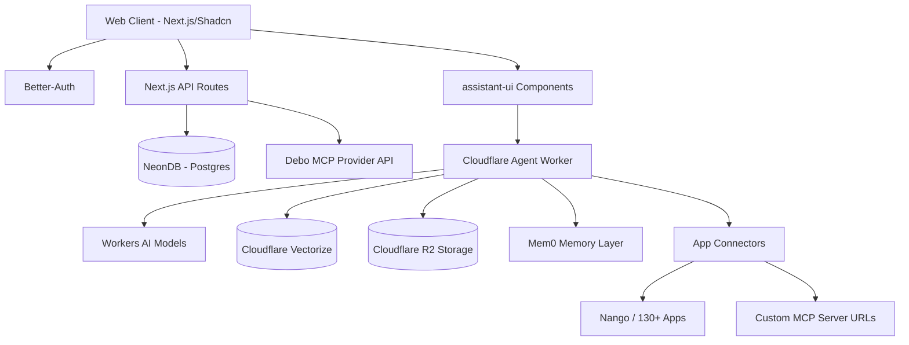

# Technical Architecture

## 1. High-Level Architecture Diagram
The architecture is strategically split between a robust Next.js frontend/backend and a high-performance Cloudflare Edge layer for AI and vector operations.

## 2. Infrastructure Components

### 2.1 Next.js Application Layer (The Host)
Handles the core web experience, user authentication UI, landing page, and rendering the Shadcn UI components.
*   **UI Foundation**: Tailwind V4 + Shadcn (strict adherence, no side-loaded custom CSS to reduce bloat).
*   **Auth Layer**: `better-auth` connected to Neon DB. Manages user sessions, OAuth logics, and access controls to AI endpoints.

### 2.2 Cloudflare Edge Layer (The Agent)
Managed via `wrangler`, this layer runs the heavy lifting for AI processing to keep Next.js lightweight.
*   **AI Router (Worker)**: A Cloudflare Worker acting as the primary agent router. It determines if it should use Cloudflare Workers AI (default) or proxy out to user-provided keys (BYOK - OpenAI/Ollama).
*   **Knowledge Base**: Cloudflare Vectorize stores vector embeddings of journal entries.
*   **Asset Storage**: Cloudflare R2 stores uploaded photos or voice memos tied to the journal.

### 2.3 Memory Engine (`mem0`)
*   Integrated into the Cloudflare Worker flow.
*   Every time a journal is saved or a chat occurs, the interaction is passed to `mem0`.
*   `mem0` extracts immutable or evolving facts (e.g., "User adopted a dog named Max", "User is stressed about the Q3 presentation").
*   These memories are injected into the context window for the `assistant-ui` chat interface.

### 2.4 Integrations Engine
*   **Standard API / SaaS**: Uses a lightweight integration platform (like Nango) to manage OAuth tokens for users connecting their Gmail or Calendar. The Cloudflare Worker has tools to fetch recent emails or today's calendar to enrich the chat context.
*   **Model Context Protocol (MCP)**:
    *   **Ingress (Custom MCP URLs)**: Users can paste an SSE/HTTP MCP server URL. The agent worker uses the MCP TS Client to connect and expose those server tools to the AI.
    *   **Egress (Debo MCP)**: The standard API exposes `/mcp` routes allowing the user's local instance of Cursor or Claude Desktop to read their journals utilizing standard MCP protocol formatting.

## 3. Data Schema overview (Neon DB & Drizzle)
*   `users`: ID, email, preferences, BYOK securely stored tokens.
*   `journals`: ID, user_id, content, date, vectorize_id, attachments_urls.
*   `integrations`: tokens for connected third-party apps.

## 4. Workflows

### Journal Ingestion & RAG
1. User writes entry -> saved to NeonDB.
2. Async trigger to CF Worker -> creates embedding via Workers AI -> stores in Vectorize.
3. Async trigger to `mem0` -> extracts facts -> stores in user's memory graph.

### AI Chat (Companion Request)
1. User types in `assistant-ui`.
2. Stream request hits Next.js, forwarded to CF agent Worker.
3. Agent uses system prompt + pulled `mem0` facts + Calendar Connector (tools).
4. Determines need to search journal history (calls Vectorize).
5. Returns streaming response powered by the user's chosen provider.
