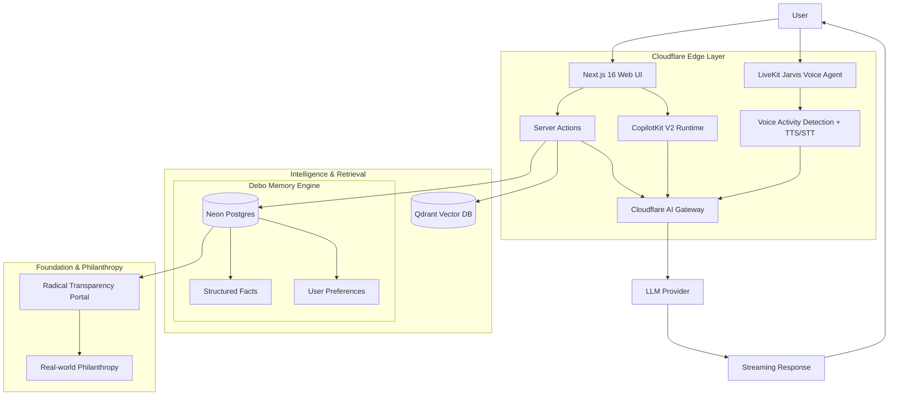

# Technical Architecture

Debo is built as a **Privacy-First Life Intelligence System**, architected for edge-latency and deep contextual recall. The system is split into four primary layers:

1. **Ambient Interface Layer**: Next.js App Router for web, and **LiveKit** for real-time, low-latency Jarvis-style voice interactions.
2. **Edge Execution Layer**: Runs on **Cloudflare Workers** (OpenNext) for sub-second global response times and AI Gateway management.
3. **Intelligence & Retrieval Layer**: Dual-store strategy using **Qdrant** for semantic search and **Neon (Postgres)** for structured, durable memories.
4. **Impact Layer**: The **Radical Transparency Portal** that connects journal activity to real-world philanthropic outcomes.

## 2. Data Flow

### Journal Flow

The journal pipeline starts when a user writes an entry.

1. The entry is saved in Neon Postgres through a server action.
2. The content is chunked for retrieval.
3. Each chunk is embedded and stored in Qdrant with payload metadata.
4. The same content is passed to the first-party memory engine for persistent memory extraction.
5. The result is a dual store: Qdrant holds searchable journal vectors, while Postgres memory tables hold durable facts and preferences.

This split matters because journal text and long-term memory serve different jobs. Qdrant is optimized for semantic retrieval of source text. The structured memory engine is optimized for stable facts that should survive summarization and re-asking.

### Query Flow

The question flow is designed for grounded answers.

1. The user sends a question through `askQuestionAction`.
2. `askLifeStream` builds context from both journals and structured memory.
3. Tools fetch the most relevant journal citations, memory citations, and recent entries.
4. The retrieved context is ranked, deduplicated, and formatted into a prompt.
5. The model generates a streaming answer with citations.

In practice the flow looks like this:

User -> askLife -> tools -> context -> LLM -> response

## 3. RAG System

Debo uses retrieval-augmented generation to answer from personal history instead of model memory alone.

### Chunking

Journal entries are split into smaller chunks before indexing. Chunking improves recall because a long entry can contain several unrelated ideas, and a single embedding for the whole entry would dilute the signal.

### Embeddings

Each chunk is embedded before being written to Qdrant. The vector store keeps the semantic representation alongside metadata such as user ID, journal ID, title, chunk index, and creation time.

### Retrieval

When the user asks a question, the query is embedded and compared against the vector index. The system fetches a larger candidate set than it will eventually return so that downstream ranking can discard weak matches.

### Ranking

The retrieval layer scores sources using semantic relevance, recency, repetition, and inferred importance. Journal sources and memory sources are merged into one ranked context set. Duplicate sources are removed before the model sees them.

This is important because a simple vector search alone is not enough. A journal answer should prefer the most recent and most informative evidence, not just the closest embedding.

## 4. Memory System

Debo's persistent memory layer is implemented in-house.

### Extraction

When a journal entry or conversation is saved, the memory engine processes the text and extracts facts that should persist beyond one session. Examples include stable preferences, recurring worries, people, goals, and ongoing projects.

### Storage

The application stores memory engine state directly in Postgres. There is no separate third-party memory provider to configure per account.

### Usage

During question answering, structured memories are retrieved alongside journal citations and folded into the context window. The assistant can then reference a stable memory such as a preference or identity fact without re-deriving it from raw journal text.

## 5. Pattern Detection Engine

Pattern detection is the layer that turns retrieved sources into higher-level insight.

### How Patterns Are Detected

The system looks for repeated entities and themes across ranked sources. That includes repeated people, topics, and emotions. It also considers recurrence across time so the output reflects habits instead of isolated events.

### Scoring Logic

Pattern strength should increase when:

1. The same entity appears in multiple sources.
2. The topics recur across separate days.
3. The sources are recent and semantically relevant.
4. The emotion or subject carries high signal for the user's question.

### Examples

- A recurring stress pattern before deadlines.
- Morning entries showing better focus and more optimistic tone.
- A specific person repeatedly appearing in both positive and negative contexts.

The goal is not to label the user. The goal is to reveal patterns that help the user make better decisions.

## 6. Timeline System

The timeline is a structured view of life over time.

### Daily Summaries

Entries can be grouped into daily views so the user can review what happened on a given day without opening every raw note.

### Aggregation

The timeline layer can aggregate entries by date, project, emotion, or theme. This makes the product useful for both short-term recall and long-term review.

The timeline is the simplest interface to the user's history, but it is fed by the same indexed data as search and memory.

## 7. Memory Graph

Debo models personal knowledge as a graph.

### Nodes

Nodes represent people, events, topics, emotions, goals, and stable facts.

### Edges

Edges represent relationships such as:

- person -> event
- emotion -> event
- topic -> goal
- person -> recurring context

### Why It Matters

A graph structure makes it possible to ask richer questions than search alone can answer. Instead of just returning a similar journal entry, Debo can connect related things and expose the shape of a user's life.

## 8. AI Orchestration

Debo uses the Vercel AI SDK for prompt execution, tool calling, and streaming responses.

### Tool Calling

The assistant can call tools for journal search, memory retrieval, and recent entries. Tools keep retrieval out of the prompt until it is needed, which reduces noise and improves grounding.

### Streaming

Answers are streamed to the UI as soon as the model starts generating. This keeps the product responsive even when the backend is doing multi-step retrieval.

### Context Building

Before generation, the system builds a compact context block containing ranked sources, snippets, and timestamps. This gives the model the evidence it needs without flooding the prompt with full documents.

### Cloudflare AI Gateway

Model traffic is routed through Cloudflare AI Gateway so providers can be managed consistently. This helps with observability, provider switching, and future failover strategies.

### CopilotKit V2 Integration

Debo uses **CopilotKit V2** for deep agentic integration within the dashboard. The runtime is hosted at `/api/copilotkit` using the `copilotRuntimeNextJSAppRouterEndpoint` handler. This allows the AI agent to interact directly with the frontend state and execute client-side actions (like searching journals or creating entries) with high reliability and zero-configuration routing.

## 9. Performance & Edge Proxy

To maintain high performance in a global environment, Debo employs a specialized **Edge Proxy Layer**:

- **Decoupled Auth Sync**: Session validation is separated from database synchronization. The system uses a lightweight `getUserId` helper to verify identity in milliseconds, while heavy synchronization tasks (like updating user profiles in the DB) are deferred or skipped during latency-sensitive operations.
- **Node.js Proxy Runtime**: The proxy runs on the standard Node.js runtime to maintain compatibility with heavy libraries while leveraging Cloudflare's global network for routing and security.

## 10. Voice Architecture (Jarvis Agent)

The voice layer is built for **human-parity latency** using LiveKit's real-time infrastructure.

1. **VAD (Voice Activity Detection)**: Processes audio at the edge to detect when the user starts/stops speaking.
2. **STT (Speech-to-Text)**: High-speed transcription using Deepgram or Whisper.
3. **Intelligence Loop**: Transcripts are piped into the `askQuestionAction` flow, retrieving personal memory and generating a response.
4. **TTS (Text-to-Speech)**: Expressive voice synthesis (Cartesia/OpenAI) that streams audio back to the user via a LiveKit Room.

## 11. Security & Privacy Architecture

Debo is built on a **Zero-Trust for Data** model:

- **E2E Encryption Vision**: Future versions will support client-side encryption for the primary journal store, where the server only sees encrypted blobs.
- **Data Sovereignty**: Users can export their entire Postgres and Vector store at any time.
- **Provider Isolation**: By using the Cloudflare AI Gateway, we can obfuscate PII before it reaches 3rd-party LLM providers.
- **Auth Security**: Powered by **Better-Auth** with secure session management and multi-factor support.

## 12. Impact-Driven Philanthropy

The architecture includes a "Philanthropy Hook":
- **Transparency Metrics**: The system tracks aggregate, anonymous usage milestones.
- **Automatic Allocation**: A portion of platform proceeds is tracked through the **Transparency Portal**, showing real-time updates on projects like "Building Wells in Rajasthan" or "School Funding in Bihar".
- **Verifiable Proof**: Every philanthropic project is documented with photos, coordinates, and cost-breakdowns linked to the blockchain (future vision) for absolute transparency.

## 13. Growth & Outreach Engine

Debo utilizes an automated **Outreach & Community Engine** powered by **Composio**:
- **Targeted Engagement**: Programmatic search for top GitHub contributors across specific tech stacks (TS, Rust, Go).
- **Personalized Outreach**: High-volume, personalized email sequences delivered via the Gmail API to invite top developers to contribute to the open-source mission.
- **Analytics-Driven**: Tracking of community engagement metrics (stars, forks, issues) to measure the impact of outreach efforts.
