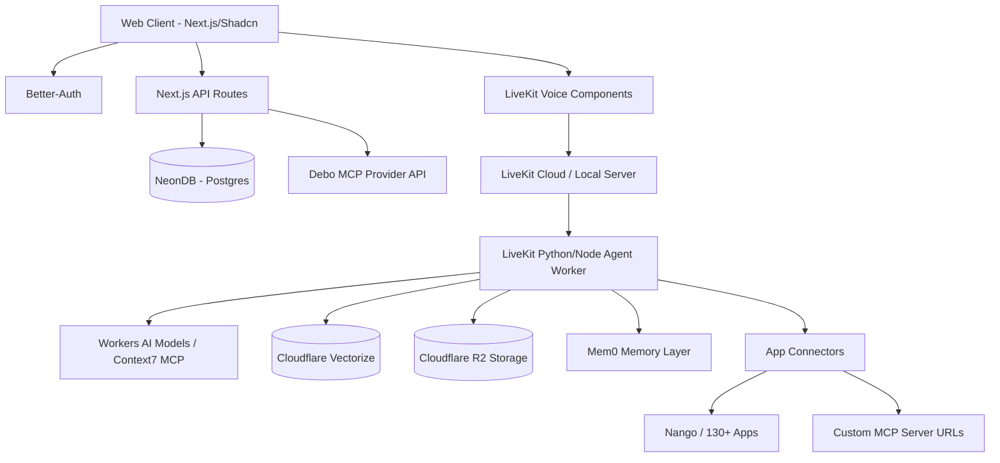

# Technical Architecture

## 1. High-Level Architecture Diagram
The architecture is strategically split between a robust Next.js frontend/backend and a high-performance Cloudflare Edge layer for AI and vector operations.

## 2. Infrastructure Components

### 2.1 Next.js Application Layer (The Host)
Handles the core web experience, user authentication UI, landing page, and rendering the Shadcn UI components.
*   **UI Foundation**: Tailwind V4 + Shadcn (strict adherence, no side-loaded custom CSS to reduce bloat).
*   **Auth Layer**: `better-auth` connected to Neon DB. Manages user sessions, OAuth logics, and access controls to AI endpoints.

### 2.2 Voice & AI Layer (LiveKit & Cloudflare)
This layer handles real-time WebRTC audio processing and AI agent orchestration.
*   **Voice Client**: Uses `@livekit/components-react` on the frontend for ultra-low latency audio streaming.
*   **Agent Worker**: A separate `livekit-agents` process (Node.js or Python) that orchestrates Speech-to-Text, LLM inference, and Text-to-Speech.
*   **Knowledge Base**: Cloudflare Vectorize stores vector embeddings of journal entries for semantic recall during voice conversations.
*   **Asset Storage**: Cloudflare R2 stores uploaded photos or voice memos tied to the journal.

### 2.3 Memory Engine (`mem0`)
*   Integrated into the backend ingestion flow.
*   Every time a journal is saved or a conversation concludes, the interaction is passed to `mem0`.
*   `mem0` extracts immutable or evolving facts (e.g., "User adopted a dog named Max", "User is stressed about the Q3 presentation").
*   These memories are injected into the context window for the LiveKit Voice Agent.

### 2.4 Integrations Engine
*   **Standard API / SaaS**: Uses an integration platform (like Nango) to manage OAuth tokens for users connecting their Gmail or Calendar. The Voice Agent has tools to fetch recent emails or today's calendar to enrich the conversation context.
*   **Model Context Protocol (MCP)**:
    *   **Context7 Integration**: The Voice Agent utilizes the Context7 MCP server to look up real-time documentation and technical information during conversations.
    *   **Debo MCP Server**: The platform exposes a dedicated `/dashboard/mcp` configuration page. Users can connect their local Cursor or Claude Desktop instances to Debo's SSE endpoints, allowing their external AI tools to read and interact with their journal data securely.

## 3. Data Schema overview (Neon DB & Drizzle)
*   `users`: ID, email, preferences, BYOK securely stored tokens.
*   `journals`: ID, user_id, content, date, vectorize_id, attachments_urls.
*   `integrations`: tokens for connected third-party apps.

## 4. Workflows

### Journal Ingestion & RAG
1. User writes entry -> saved to NeonDB.
2. Async trigger to CF Worker -> creates embedding via Workers AI -> stores in Vectorize.
3. Async trigger to `mem0` -> extracts facts -> stores in user's memory graph.

### Real-time Voice Interaction (LiveKit Agent)
1. User connects via the LiveKit React component on the dashboard.
2. WebRTC audio stream connects to LiveKit Server.
3. The `livekit-agents` worker receives audio, uses STT to transcribe.
4. Agent queries system prompt + pulled `mem0` facts + available Tools (Context7 MCP, Calendar Connector).
5. Determines need to search journal history (calls Vectorize).
6. Streams TTS response back to the user with sub-second latency.
